# AI Video & Image Creator Portfolio — Shruti Srivastava

Portfolio submitted in application for the **AI Video & Image Creator** role,
showcasing work produced for the Instagram account **@tinytoon_tunes23**.

## Folder structure

```
portfolio/
├── README.md                     ← this file
├── index.html                    ← the full portfolio (open this)
├── .gitignore
└── preview/
    ├── site-scroll-preview.mp4   ← 8-sec scroll-through of the live site
    ├── 01-hero.png                ← section screenshot
    ├── 02-reels.png               ← section screenshot
    ├── 03-showreel.png            ← section screenshot
    ├── 04-gallery.png             ← section screenshot
    ├── 05-skills.png              ← section screenshot
    ├── 06-contact.png             ← section screenshot
    └── content-images/
        ├── img-01-portrait-red-saree.jpg
        ├── img-02-portrait-black-dress.jpg
        ├── img-03-portrait-white-shirt.jpg
        ├── img-04-aesthetic-mood-edit.jpg
        └── img-05-reel-storyboard.jpg
```

## How to view it

Double-click `index.html` or open it in any web browser (Chrome, Safari,
Edge, etc.). No internet connection or install needed — all 9 video clips,
the showreel, and all images are embedded directly in that one file.

## Publish it on GitHub Pages (optional)

1. Push this folder to a new GitHub repo.
2. In the repo, go to **Settings → Pages**.
3. Under **Source**, choose the `main` branch and `/ (root)` folder, then save.
4. GitHub will publish `index.html` at `https://<your-username>.github.io/<repo-name>/`
   — a live link you can share instead of the file itself.

---

## Site preview — every section

### Hero
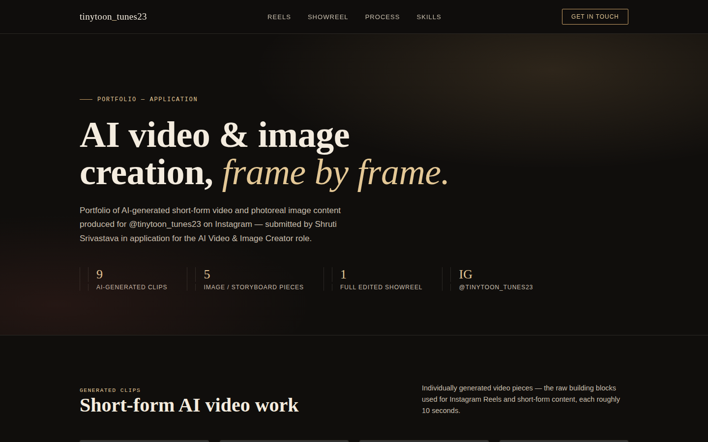

### Reels grid
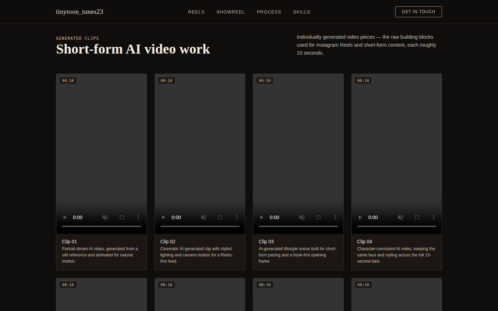

### Showreel
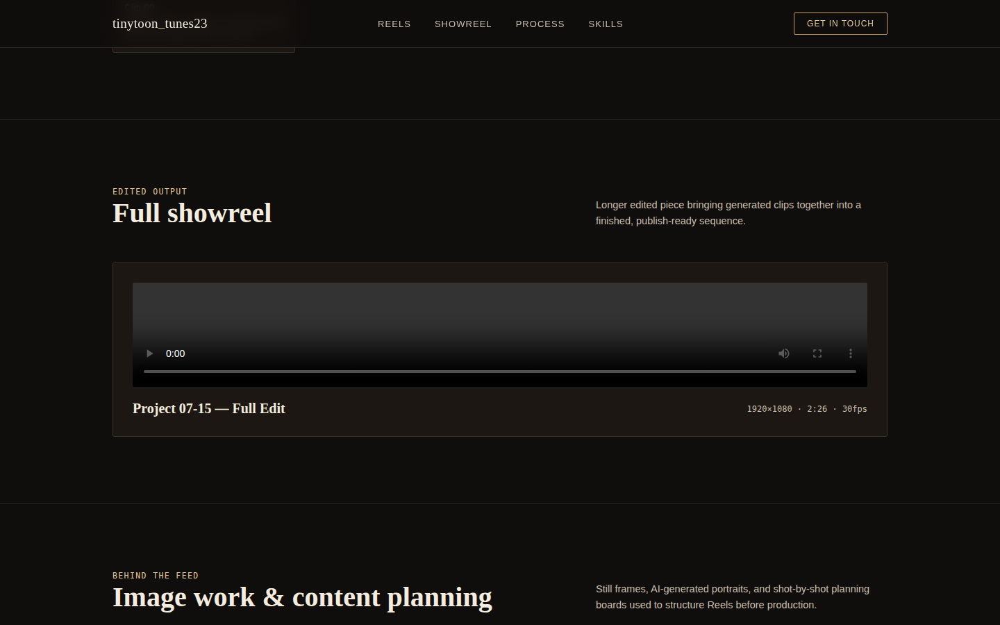

### Image gallery
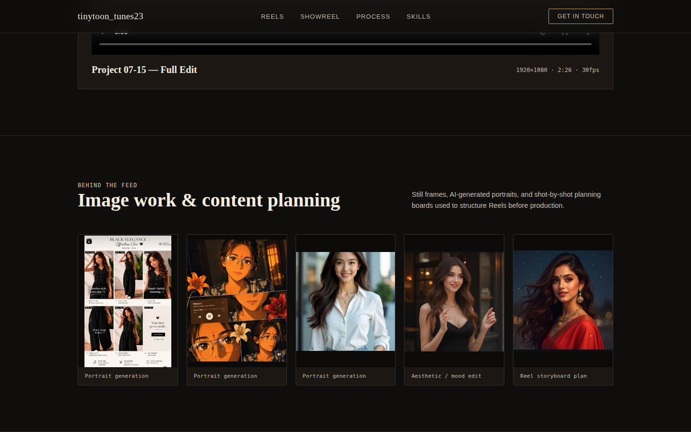

### Skills
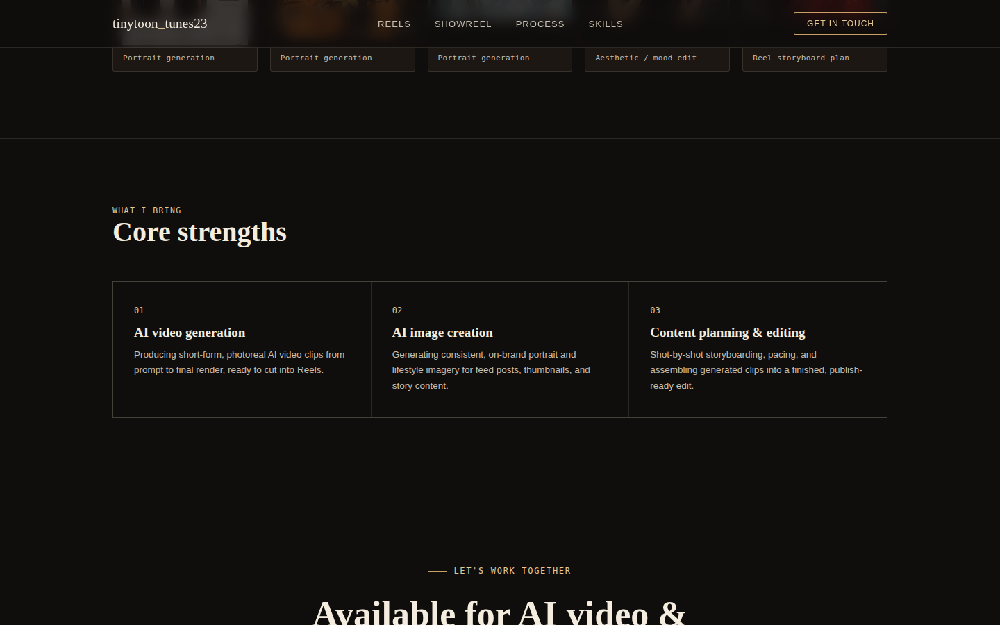

### Contact
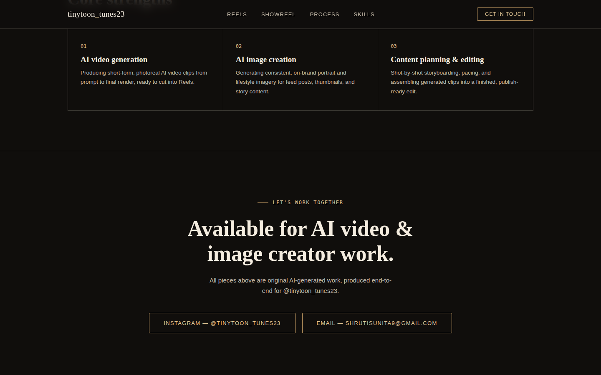

---

## Content images — full size

### Portrait — red saree
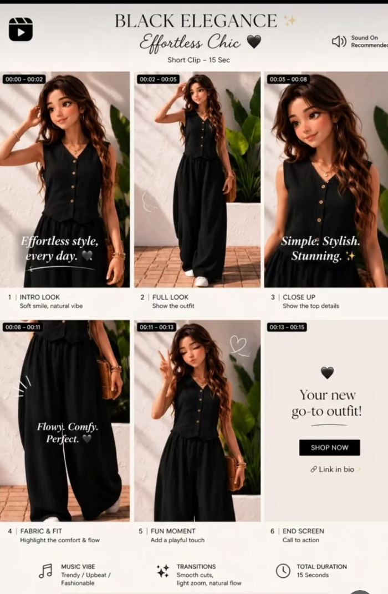

### Portrait — black dress
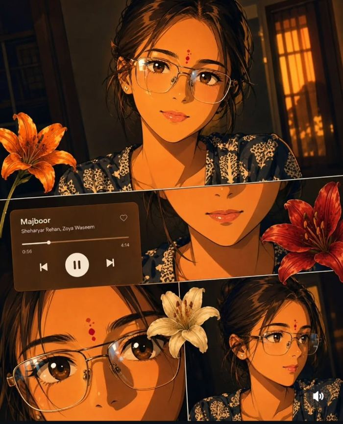

### Portrait — white shirt
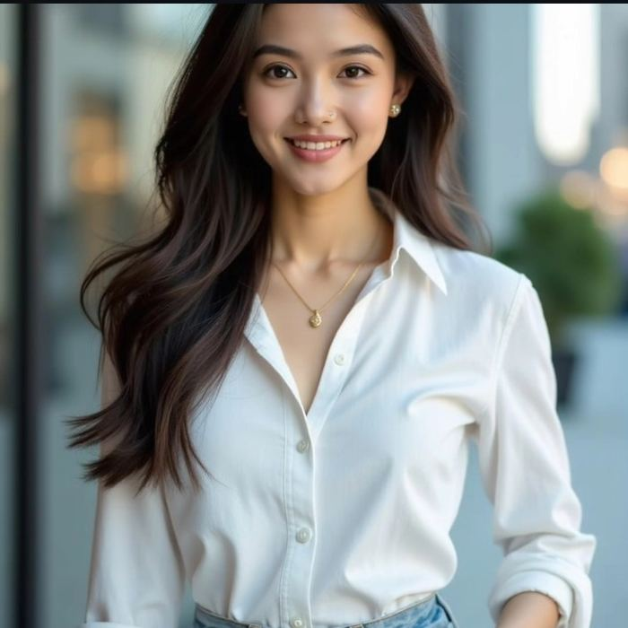

### Aesthetic / mood edit
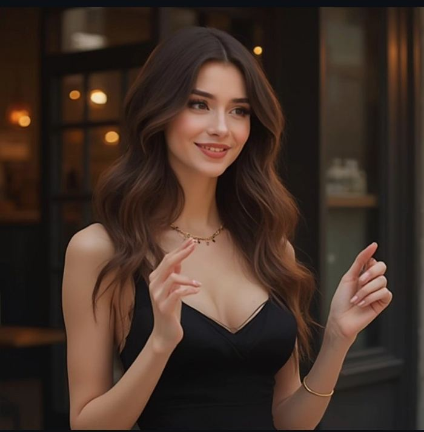

### Reel storyboard plan
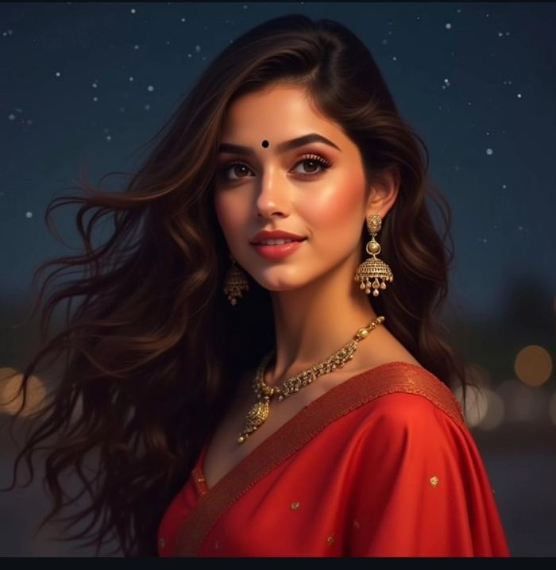

---

## What's inside the portfolio

- 9 short-form AI-generated video clips
- 1 longer edited showreel (Project 07-15)
- 5 AI-generated images / content-planning screenshots
- Skills summary and contact details

## Contact

- Instagram: [@tinytoon_tunes23](https://instagram.com/tinytoon_tunes23)
- Email: shrutisunita9@gmail.com
